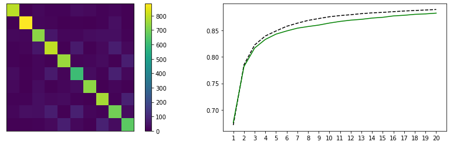
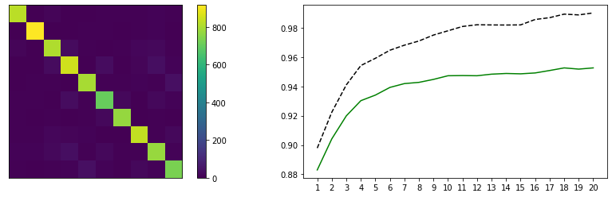
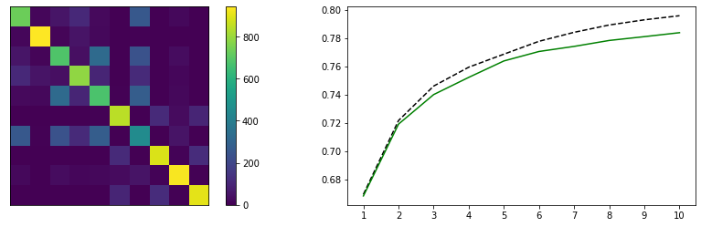
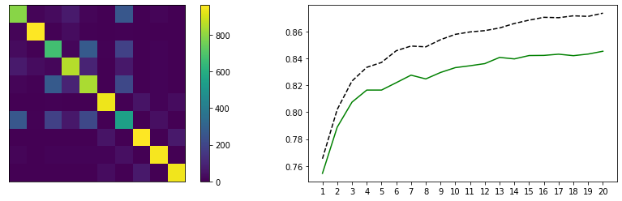
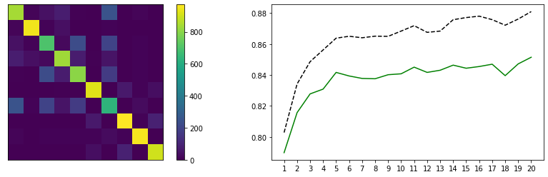
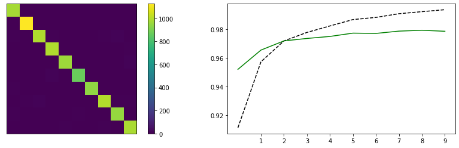
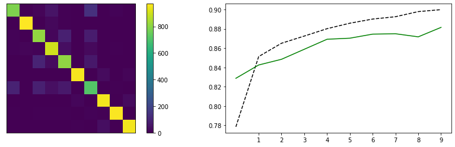
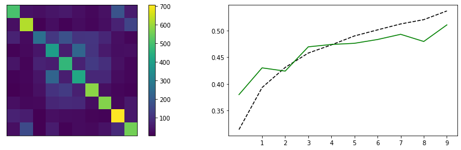

# Лабораторная работа по курсу "Искусственный интеллект"
# Многослойный персептрон

| Студент | Бирюков В.В. |
|------|------|
| Группа  | 7 |
| Оценка 1 (свой фреймворк) | *X* |
| Оценка 2 (PyTorch/Tensorflow) | *X* |
| Проверил | Сошников Д.В. |

> *Комментарии проверяющего*
### Задание

Решить задачу классификации для датасетов MNIST, FashionMNIST, CIFAR-10 с помощью 1, 2 и 3-слойного персептрона. Попробовать разные передаточные функции, провести сравнительную оценку решений. Решение сделать двумя способами:
* "С нуля", на основе базовых операций библиотеки numpy. Решение желательно реализовать в виде библиотеки, пригодной для решения более широкго круга задач.
* На основе одного из существующих нейросетевых фреймворков, в соответствии с вариантом задания:
   1. PyTorch
   1. Tensorflow/Keras

> *Номер варианта вычисляется по формуле 1 + (N-1) mod 2, где N - номер студента в списке.*

Решение оформить в файлах [Solution_MyFramework.ipynb](Solution_MyFramework.ipynb) и [Solution.ipynb](Solution.ipynb). 
Отчет по работе и сравнение методов пишется в этом файле после задания.
### Критерии оценки

Первая часть лабораторной работы:

| Сделано | Баллы |
|---------|-------|
| Реализован однослойный персептрон, классифицирующий датасет с точностью >85% | 1 |
| Реализован многослойный персептрон, классифицирующий датасет с точностью >85% | 2 |
| Реализация сделана как библиотека для обучения сетей различных конфигураций, в соответствии с примером | 1 |
| Улучшена архитектура библиотеки, отдельно вынесены алгоритмы обучения, функции потерь | 3 |
| Проведено сравнение различных гиперпараметров, таких, как передаточные функции, число нейронов в промежуточных слоях, функции потерь, с графиками обучения и матрицами неточности | 2 |
| Проведен анализ для датасета FashionMNIST | 1 |

Вторая часть лабораторной работы:

| Сделано | Баллы |
|---------|-------|
| Реализован однослойный персептрон, классифицирующий датасет с точностью >85% | 1 |
| Реализован многослойный персептрон, классифицирующий датасет с точностью >85% | 2 |
| Реализация использует возможности базового фреймворка, включая работу с данными | 3 |
| Проведено сравнение различных гиперпараметров, таких, как передаточные функции, число нейронов в промежуточных слоях, функции потерь, с графиками обучения и матрицами неточности | 2 |
| Проведен анализ для датасета FashionMNIST | 1 |
| Проведен анализ для другого датасета с цветными картинками (CIFAR-10) | 1 |

## Отчёт по работе

### Первая часть лабораторной работы

В рамках реализации нейросетевого фреймворка создан класс Net, который может хранить какое-либо количество слоев. Слоями выступают простые линейные слои, передаточные функции, функции потерь, дополнительные функции, такие как Softmax. Гиперпараметрами сети является функция потерь, которая не входит явно в число слоев, и алгоритм оптимизации.

Реализованы передаточные функции: гиперболический тангенс, сигмоида, ReLU, softplus; функции потерь: Cross Entropy Loss и среднеквадратичная ошибка; алгоритмы оптимизации: градиентный спуск, ипмульсный градиентный спуск, Adagrad, RMSProp. При обучении сети оптимизатор используется или напрямую, или с наилучшим шагом, выбранным при помощи тернарного поиска. В сочетании с градиентным спуском - получаем алгоритм наискорейшего градиентного спуска, но этот метод можно использовать и с другими оптимизаторами, в программе учтена их особенность накопления обновлений.

При обучении однослойного перцептрона на датасете MNIST, наилучшие результаты - 88% - получены при использовании функции потерь Cross Entropy Loss и алгоритмов оптимизации Adagrad или RMSProp:

Двуxслойный перцептрон справляется значительно лучше. При числе скрытых нейронов 200 и передаточной функции ReLU, а так же Cross Entropy Loss и RMSProp, точность - 96%, однако точность на обучающей выборке приближается к 100%. При использовании Adagrad точность 95%, и график обучения более гладкий:

Добавление третьего слоя размером 100 увеличивает точность на один процент при тех же остальных параметрах:

При анализе датасета FashionMNIST лучшие результаты получены при использовании Cross Entropy Loss, Adagrad и ReLU:

* однослойный перцептрон - 78%

* двухслойный перцептрон - 84%

* трехслойный перцептрон - 85%

В ходе выполнения работы были обнаружены различные особенности используемых функций и алгоритмов. Так функция квадратичной ошибки не допускает сильного разрыва между тренировочной и тестовой точностями, однако очень сильно зависит от начальных данных и может привести как к очень хорошим, так и к очень плохим результатам. При использовании передаточных функций ReLU и SoftPlus разрыв точностей сильнее, чем для сигмоиды и гиперболического тангенса, однако точность быстрее растет. Среди оптимизирующих методов также наблюдается подобное поведение. В порядке увеличения скорости роста точности и величины разрыва: импульcный градиентный спуск, Adagrad, градиентный спуск, RMSProp. Наискорейший градиентный спуск сначала показался хорошим способом ускорить оптимизацию, однако затем практически не использовался из-за существенного увеличения времени обучения, особенно многослойных сетей, при незначительном росте точности, сравнимого с использованием других оптимизаторов.

Обнаружена следующая зависимость от размеров minibatch - при слишком большом размере наблюдается явное ухудшение модели, так что одним из способов увеличить точность является уменьшение размеров. Однако при слишком маленьком размере, оптимизатор может начать проскакивать минимум, что приводит к зигзагообразному графику точности и непредсказуемому результату.

Схожая зависимость и от шага обучения - увеличение шага ведет к ускорению обучения. При большом шаге может также возникнуть скачущая точность. Оптимальный шаг отличается для разных оптимизаторов. Для любых алгоритмов и конфигураций однако существует единый верхний предел шага, выше которого веса увеличиваются, а вероятности уменьшаются настолько сильно, что приводят к делению на ноль при вычислении производной Softmax. Этот эффект можно ослабить, уменьшив дисперсию в распределении начальных весов (установлено эмпирическим путем).

### Вторая часть лабораторной работы

В ходе выполнения второй части лабораторной работы был изучен фреймворк Tensorflow/Keras. Keras содержит простой способ создания модели из списка слоев, который и был использован для лабораторной. Tensorflow имеет удобный функционал для загрузки классических датасетов и для взаимодействия с самими датасетами.

При обучении на датасете MNIST получены результаты:

* однослойный персептрон - 93%

* многослойный персептрон - 98%

Датасет FashionMNIST - точность 88% при использовании трех слоев и оптимизатора adam:

Датасет CIFAR-10 оказался намного более сложным для линейных слоев. При увеличении размера скрытых слоев результат улучшается. Наибольшая точность - 50%:

Выводы, полученные из первой части лабораторной, в целом остались справедливы и для второй части. Использование библиотеки позволило сравнить больше различных оптимизаторов и функций активации. При сравнении оптимизаторов лучшие результаты показывает adam. Импульсный градиентный спуск показывает себя лучше, чем в самостоятельной реализации. Оптимальные функции активации - relu, elu, sigmoid. Проблем с шагом обучения уже не наблюдось, слишком большой шаг так же приводит к нестабильному обучению.

## Codespaces

По возможности, используйте GitHub Codespaces для выполнения работы. По результатам, дайте обратную связь:
1. Что понравилось?
1. Что не понравилось?
1. Какие ошибки или существенные затруднения в работе вы встречали? (По возможности, будьте как можно более подробны, указывайте шаги для воспроизведения ошибок)

## Материалы для изучения

 * [Реализация своего нейросетевого фреймворка](https://github.com/shwars/NeuroWorkshop/blob/master/Notebooks/IntroMyFw.ipynb)
 * [Введение в PyTorch](https://github.com/shwars/NeuroWorkshop/blob/master/Notebooks/IntroPyTorch.ipynb)
 * [Введение в Tensorflow/Keras](https://github.com/shwars/NeuroWorkshop/blob/master/Notebooks/IntroKerasTF.ipynb)
