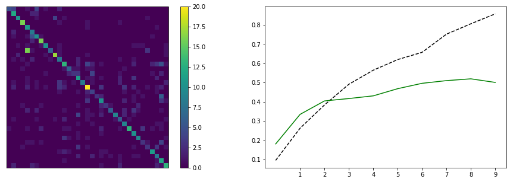
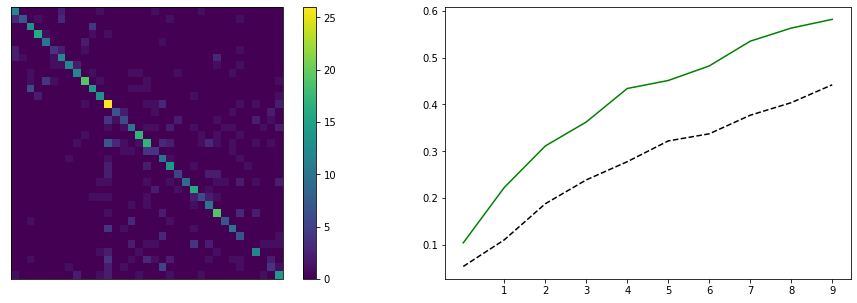
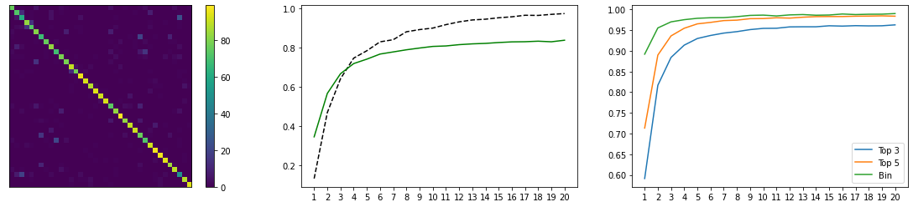
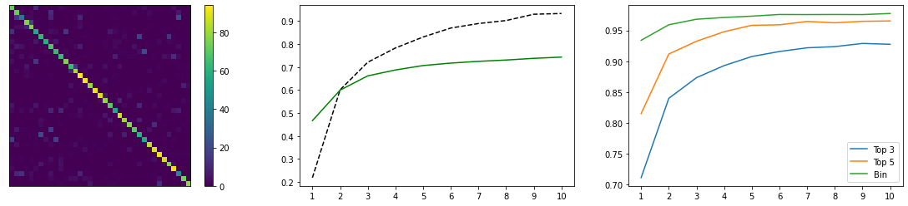

[](https://classroom.github.com/online_ide?assignment_repo_id=7812442&assignment_repo_type=AssignmentRepo)
# Лабораторная работа по курсу "Искусственный интеллект"
# Классификация изображений.

| Студент | *ФИО* |
|------|------|
| Группа  | *№* |
| Оценка 1 (обучение "с нуля") | *X* |
| Оценка 2 (transfer learning) | *X* |
| Проверил | Сошников Д.В. |

> *Комментарии проверяющего*
### Задание

Решить задачу классификации пород кошек и собак на основе датасета [Oxford-IIIT](https://www.robots.ox.ac.uk/~vgg/data/pets/).


#### Задание 1: Классификация Pet Faces

Обучить свёрточную нейронную сеть для классификации пород кошек и собак на основе упрощённого датасета **Pet Faces**. Самостоятельно придумать архитектуру сети, реализовать предобработку входных данных.

Для загрузки датасета используйте следующий код:

```python
!wget https://mslearntensorflowlp.blob.core.windows.net/data/petfaces.tar.gz
!tar xfz petfaces.tar.gz
!rm petfaces.tar.gz
```

В качестве результата необходимо:

* Посчитать точность классификатора на тестовом датасете
* Посчитать точность двоичной классификации "кошки против собак" на текстовом датасете
* Построить confusion matrix
* **[На хорошую и отличную оценку]** Посчитайте top-3 accuracy
* **[На отличную оценку]** Выполнить оптимизацию гиперпараметров: архитектуры сети, learning rate, количества нейронов и размеров фильтров.

Решение оформите в файле [Faces.ipynb](Faces.ipynb).

Использовать нейросетевой фреймворк в соответствии с вариантом задания:
   * Чётные варианты - PyTorch
   * Нечётные варианты - Tensorflow/Keras
#### Задание 2: Классификация полных изображений с помощью transfer learning

Используйте оригинальный датасет **Oxford Pets** и предобученные сети VGG-16/VGG-19 и ResNet для построение классификатора пород. Для загрузки датасета используйте код:

```python
!wget https://mslearntensorflowlp.blob.core.windows.net/data/oxpets_images.tar.gz
!tar xfz oxpets_images.tar.gz
!rm oxpets_images.tar.gz
```

В качестве результата необходимо:

* Посчитать точность классификатора на тестовом датасете отдельно для VGG-16/19 и ResNet, для дальнейших действий выбрать сеть с лучшей точностью
* Посчитать точность двоичной классификации "кошки против собак" на текстовом датасете
* Построить confusion matrix
* **[На отличную оценку]** Посчитайте top-3 и top-5 accuracy

Решение оформите в файле [Pets.ipynb](Pets.ipynb).

Использовать нейросетевой фреймворк, отличный от использованного в предыдущем задании, в соответствии с вариантом задания:
   * Нечётные варианты - PyTorch
   * Чётные варианты - Tensorflow/Keras

## Отчет

### Задание 1

**Вариант:** PyTorch

В качестве глобальной архитектуры я выбрал сеть с тремя сверточными и тремя линейными слоями и затем оптимизировал параметры самих слоев: количество нейронов, размеры и количество фильтров, шаг свертки. После каждого сверточного слоя применяется субдискретизация, функция активации едина для сверточной и для линейной части.

Оптимальные параметры: функция активации - гиперболический тангенс; оптимизатор - Adam с шагом 0.0002; фильтры - 11x11, 5x5, 3x3; количества каналов - 64, 96, 128; линейные слои - чем крупнее, тем лучше, я остановился на 1024 и 1024; первый сверточный слой проходит с шагом 2, остальные - 1.

Результаты:
```
Accuracy: 0.5008
Top-3 accuracy: 0.7247
Binary accuracy: 0.9005
```



Затем я использовал механизм аугментации данных, воспользовавшись встроенным набором преобразований. Это несколько улучшило результаты и, судя по кривой обучения, модель можно обучить еще больше:
```
Accuracy: 0.5816
Top-3 accuracy: 0.8196
Binary accuracy: 0.9409
```



### Задание 2

**Вариант:** Tensorflow/Keras

Для сети VGG я использовал три дополнительных линейных слоя c числом нейронов в скрытых слоях 4096 и 4096. Это в целом соотвествует оригинальному классификатору, за исключением выходного слоя. В качестве функции активации остался tanh, в качестве оптимизатора - Adam с шагом 0.00001.

Датасет в этом задании не очень большой и имеющаяся в keras версия имеет разбиение 50:50, которое я решил не менять. Поэтому без аугментации удается достичь точности в 70%, при этом точность на обучающей выборке быстро становится 100%. Аугментация, даже однократная, позволяет обучать дольше, что приводит к 84% на породах и 99% на видах.
```
Accuracy: 0.8389207124710083
Top-3 accuracy: 0.9629327058792114
Top-5 accuracy: 0.9839193224906921
Binary accuracy: 0.9902985692024231
```



ResNet показывает меньшие результаты. Наибольшие получены с использованием двух скрытых слоев по 1024 нейрона каждый.
```
Accuracy: 0.7435268759727478
Top-3 accuracy: 0.9275006651878357
Top-5 accuracy: 0.9653856754302979
Binary accuracy: 0.9775038361549377
```



### Выводы

В ходе выполения лабораторной работы я познакомился со сверточными сетями и использованием предобученных моделей. Вторая часть оказалось несколько сложнее, например, не сразу выяснилось, что каждая модель принимает данные в особом формате, который может очень сильно отличаться от обычного. Пришлось ознакомится с фреймворком, который был не охвачен в предыдущей работе, и по итогу выполнения лабораторной я могу сказать, что, тогда как работа с собственно нейросетями в них практически одинакова, в PyTorch мне больше понравилась работа с данными и создание собственных метрик, а в Keras - использование встроенных метрик, которые можно удобно отслеживать в процессе обучения. Также интересно было использовать увеличение данных, которое позволяет добиться хороших результатов даже при небольшой обучающей выборке и которое особенно удобно делать в случае изображений.

## Codespaces

По возможности, используйте GitHub Codespaces для выполнения работы. По результатам, дайте обратную связь:
1. Что понравилось?
1. Что не понравилось?
1. Какие ошибки или существенные затруднения в работе вы встречали? (По возможности, будьте как можно более подробны, указывайте шаги для воспроизведения ошибок)

## Материалы для изучения

* [Deep Learning for Image Classification Workshop](https://github.com/microsoft/workshop-library/blob/main/full/deep-learning-computer-vision/README.md)
* [Convolutional Networks](https://github.com/microsoft/AI-For-Beginners/blob/main/4-ComputerVision/07-ConvNets/README.md)
* [Transfer Learning](https://github.com/microsoft/AI-For-Beginners/blob/main/4-ComputerVision/08-TransferLearning/README.md)
